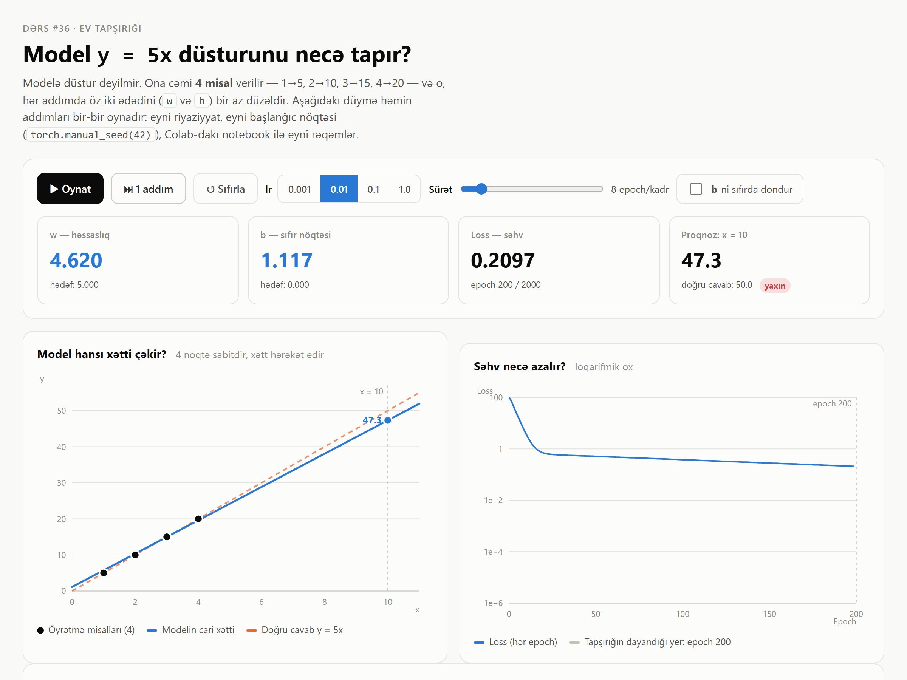

<h1 align="center">AI Mühəndisliyi kursu — ev tapşırıqları</h1>

  
  
  
  

<b>Dərs #36</b> — modelə <code>y = 5x</code> düsturu deyilmir; o, cəmi <b>4 misaldan</b> özü tapır.

  

## Dərs #36 · `ders-36-pytorch/`

| | |
|---|---|
| 📓 [`ders36_ev_tapsirigi.ipynb`](ders-36-pytorch/ders36_ev_tapsirigi.ipynb) | Tam həll, 10 hüceyrə · T4 GPU · loss qrafiki · `x = 10` proqnozu |
| 🎛 [`simulyator.html`](ders-36-pytorch/simulyator.html) | Öyrənməni addım-addım oynadır · tək fayl, internetsiz işləyir |
| 📋 [`hucreler.md`](ders-36-pytorch/hucreler.md) | Hüceyrələr, mövcud Colab-a yapışdırmaq üçün |
| 🎤 [`numayis.md`](ders-36-pytorch/numayis.md) | Nümayiş skripti + müəllim sualları və cavabları |

### Nəticə — dürüst

| | 200 epoch *(tapşırığın skeleti)* | 2000 epoch | `b` dondurulmuş |
|---|---|---|---|
| `w` | **4.620** | **4.998** | **5.000** |
| `b` | 1.117 | 0.005 | 0 *(sabit)* |
| `x = 10` | **47.3** | **49.99** | **50.00** |

Tapşırıq 50 vəd edir, skelet isə 47.3 verir. **Səbəb kod deyil:** `nn.Linear` `b`-ni
də öyrənir, 200 addımda `b ≈ 1.12` qalır və `w` onu kompensasiya edir. Simulyatorda
**«b-ni sıfırda dondur»** açarı bunu bir kliklə sübut edir — model ~56 addımda dəqiq
`50.0` verir. Skelet gizlicə dəyişdirilməyib; uzun təlim ayrıca hüceyrədədir.
